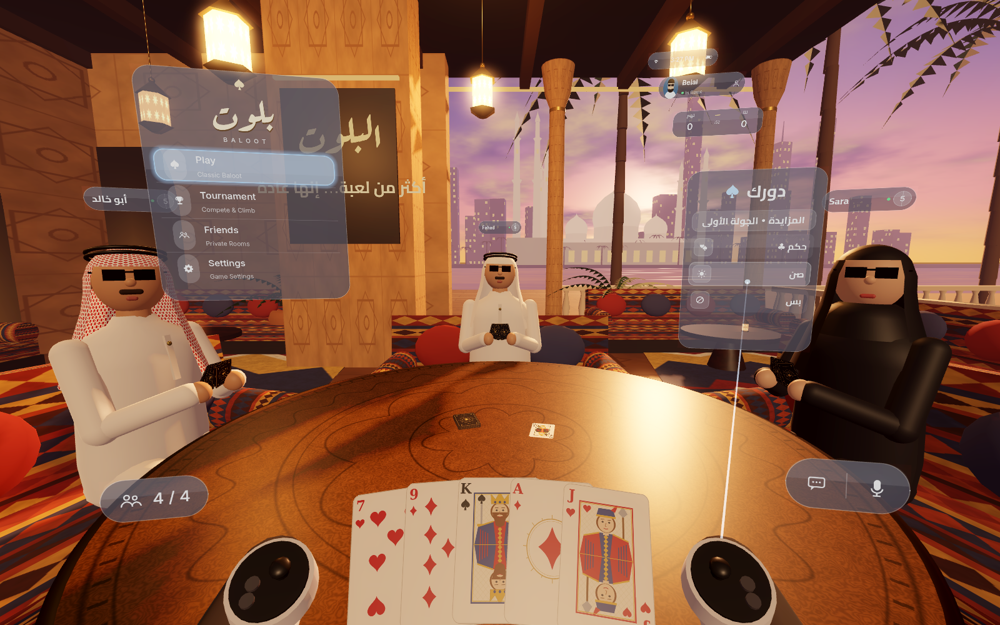
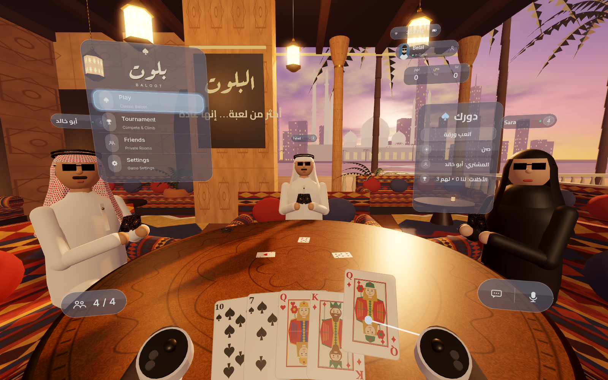

# Baloot VR — بلوت

Saudi Baloot (بلوت) for Meta Quest, played in a sunset majlis with three
companions (أبو خالد, Fahad, Sara) and a visionOS-inspired glass interface.

Built with Godot 4.4.1 (GL Compatibility renderer + OpenXR). Everything is
procedural: the scene, avatars, cards, textures and icons are generated in
code or by `tools/gen_textures.py`; the only third-party assets are the fonts
(Cairo, Aref Ruqaa, Inter — SIL OFL, licences in `assets/fonts/`, plus DejaVu Sans).

## Gameplay

* Full Saudi Baloot: 32-card deck, dealing 5 + face-up card (المكشوفة), two
  bidding rounds (حكم / صن / أشكل / بس / ولا), 8 tricks, follow-suit and
  must-trump / over-trump rules in Hokm.
* Projects (مشاريع): سرا، خمسين، مية، أربعمية, and بلوت (K+Q of trump).
* Scoring: Sun ×2/10 (26), Hokm /10 (16), last trick +10, خسرانة when the buyers
  score less than the defenders, كبوت for all eight tricks, game to 152.
* Three bots that remember played cards, feed points to a winning partner and
  win tricks as cheaply as possible. You play with Fahad against أبو خالد & Sara.

## Controls (Quest)

| Action | Input |
| --- | --- |
| Point at a window / card | Either controller's laser |
| Select, play a card, press a button | Trigger (or grip) |
| Recenter the seated view | **B** / **Y**, or Settings → Recenter view |

It is a seated experience (local reference space). On desktop without a
headset it falls back to a mouse-driven camera (left click = trigger, right
drag = look around, F12 = screenshot).

## Project layout

```
scripts/rules.gd        card strength, points, legal moves, projects, scoring
scripts/match.gd        pure match state machine (dealing, bidding, tricks)
scripts/ai.gd           bot bidding and play
scripts/game.gd         3D presentation: animations, turns, player input
scripts/environment.gd  majlis, lanterns, skyline, sky/water shaders
scripts/avatar.gd       seated companions
scripts/player_rig.gd   OpenXR rig, controllers, lasers, desktop fallback
scripts/ui/*            glass windows (SubViewport UI on quads)
tests/sim.gd            headless soak test: 300 bot games
tools/                  texture generator, APK build + Quest manifest patcher
```

## Test

```
godot --headless --path . -s tests/sim.gd
```

## Build the Quest APK

Godot only writes Quest/OpenXR manifest entries in Gradle builds. To avoid
needing the Android SDK + Gradle, `tools/build_quest_apk.sh` exports with
Godot's prebuilt template and then:

1. decodes it with apktool,
2. `tools/patch_quest_apk.py` switches the launch flags to OpenXR, adds the
   `com.oculus.intent.category.VR` category, supported devices
   (Quest 2 / Pro / 3 / 3S), head-tracking feature, OpenXR loader permissions
   and broker queries, raises `minSdkVersion` to 29, and copies in the Khronos
   OpenXR loader (`libopenxr_loader.so` from the GodotVR vendors plugin 4.3.1),
3. rebuilds, zip-aligns and signs (v2 + v3) with uber-apk-signer.

Requirements: Godot 4.4.1 + export templates, `apktool.jar`,
`uber-apk-signer.jar`, the loader, and a keystore. Paths default to `/opt/vr`
(override with `VR_TOOLS`, `GODOT`, `KEYSTORE`, `KS_ALIAS`, `KS_PASS`).

```
tools/build_quest_apk.sh          # → build/BalootVR-quest.apk
adb install -r build/BalootVR-quest.apk
```

## Publishing on the Horizon Store

Before submitting you still need to: create the app in the Meta Horizon
Developer Dashboard, sign with a keystore you keep safe (every update must use
the same key), bump `version/code` in `export_presets.cfg` for each upload,
prepare store art (cover, hero, screenshots, trailer) and a privacy policy, and
run the VRC checks (`ovr-platform-util` / Meta Quest Developer Hub). Upload with
`ovr-platform-util upload-quest-build`.

## Screenshots



