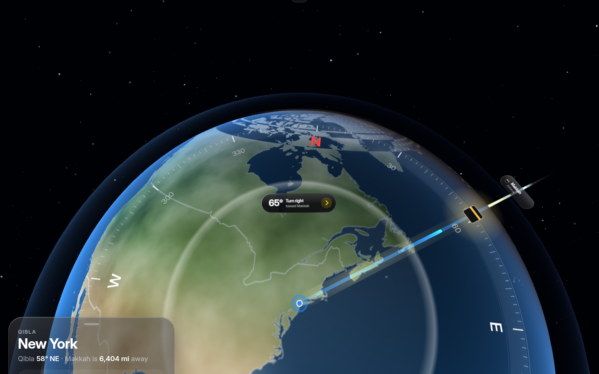
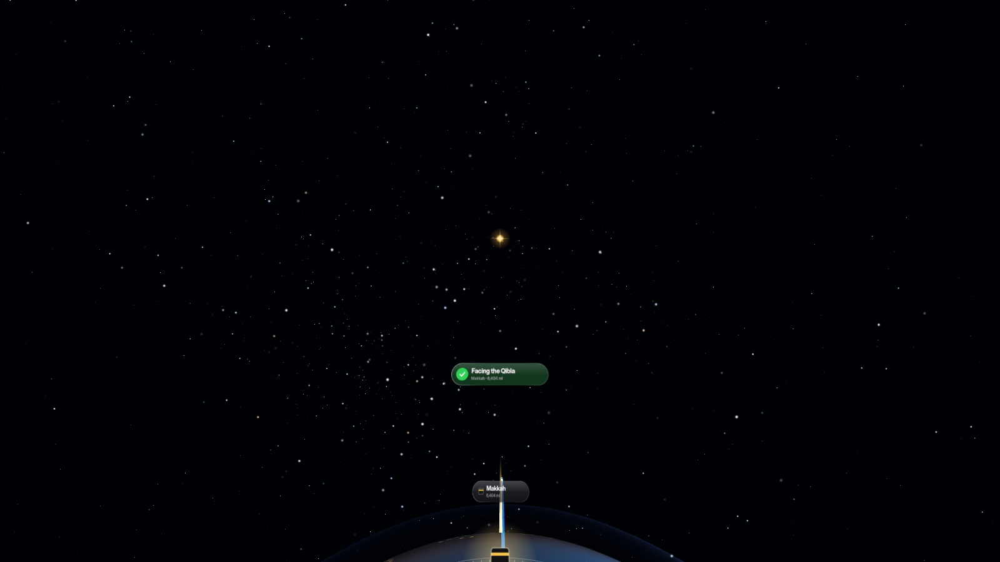
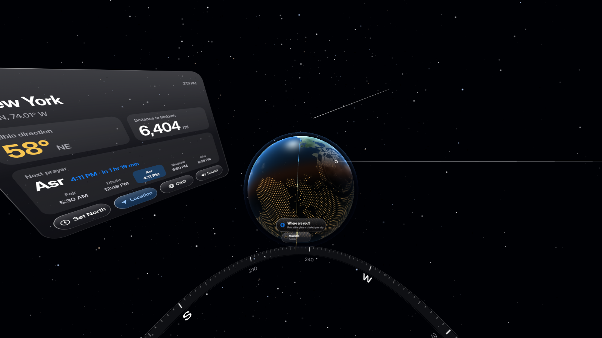

# Qibla for Meta Quest

Stand above the Earth, look down at where you are, and turn until you face Makkah.

A WebXR app for Meta Quest, packaged for the Meta Horizon Store as a Progressive Web App.
It is inspired by Google's [Qibla Finder](https://qiblafinder.withgoogle.com/intl/en/desktop)
and styled after Apple's Liquid Glass design language.

| Standing above home | Facing the Qibla | Tabletop globe |
|---|---|---|
|  |  |  |

## What you experience

- **You, in space.** You stand on a glass disc floating above a living Earth. The blue
  location dot under your feet is where you are.
- **A living planet.** The day/night terminator, sunrise glow, ocean glint and the sun
  in the sky are all computed for *right now*. Clouds drift. At night, land glows as a
  golden dot matrix.
- **The path to Makkah.** A great-circle arc leaves your feet and flows toward a pillar
  of light at the Kaaba. A golden star sits on the horizon in the exact Qibla direction,
  and a compass ring on the floor carries a Kaaba marker and a glowing path.
- **Turn to face it.** A Dynamic Island–style pill below your gaze says "Turn right · 34°",
  with light haptic detents every 15°. When you are within 5°, it turns green ("Facing the
  Qibla"), a soft chime plays and the controller pulses.
- **Glass card.** Your place, the Qibla bearing, the distance, the next prayer with a
  countdown, and all five prayer times. There are buttons for **Set North**, **Location**,
  **Globe/Orbit** and **Sound**. Squeeze grip to bring the card in front of you.
- **Tabletop globe.** Switch to a globe floating at arm's length, still aligned to real
  north. In **Location** mode, point at the globe and select to set where you are.
- **Mixed Reality.** In passthrough, the globe, compass ring and Qibla path appear in your
  real room, which is useful for finding the prayer direction on your actual floor.

## Two things a headset can't know (and how the app handles them)

1. **North.** Quest headsets have no magnetometer. The first time, the app asks you to
   *point toward north* with a controller or hand and select. Your phone's compass helps
   here. The app then saves this as a **persistent spatial anchor** (WebXR Anchors), so it
   stays aligned to your room across sessions and recentering, on runtimes that support it.
   Otherwise it asks again at the start of each session.
2. **Location.** Quest has no GPS. The app tries the browser's geolocation (Wi-Fi based).
   If that isn't available, you choose your city by pointing at the globe, or by searching
   a city on the 2D page. The Qibla bearing uses the great-circle formula, and prayer
   times come from [adhan](https://github.com/batoulapps/adhan-js) with a regional default
   method (you can change it).

Everything runs on the device. No network calls, no analytics, no accounts.

## Design notes

- **Type:** the UI font stack asks for SF Pro first, so Apple devices get it on the 2D
  page. Apple's license does not allow shipping SF Pro inside an app for another
  platform. So in the headset the text uses **Inter** (open source, bundled) with
  optical sizing and SF-style tracking: tighter at display sizes, looser when small.
- **Surfaces:** dark Liquid Glass with a translucent body, top sheen and a specular rim
  lit from the top-left. Colors are iOS system colors (dark mode): blue `#0A84FF`,
  green `#30D158`, red `#FF453A`, and a warm gold for the Kaaba. Motion uses spring
  curves on the 2D page and exponential smoothing in 3D.

## Develop

```bash
npm install
npm run dev              # http://localhost:5173
```

- **Desktop:** drag to look around. Scroll to zoom. Click the glass buttons.
- **Headset-free VR testing:** open `http://localhost:5173/?emulate`. This runs Meta's
  [Immersive Web Emulator](https://github.com/meta-quest/immersive-web-emulation-runtime)
  with an on-screen Quest 3 and controllers. It works in dev builds only.
- **On a Quest over USB:** WebXR requires HTTPS, but `localhost` counts as secure. Run
  `adb reverse tcp:5173 tcp:5173` and open `http://localhost:5173` in the Quest Browser.
- **Phones:** tap **Use Compass** to align the scene to the real world with the phone's
  compass, like Google's mobile Qibla Finder.

`npm run build` writes a static site to `dist/`.

## Publish to the Meta Horizon Store

The Horizon Store accepts WebXR apps as PWAs, wrapped in an Android package with
Meta's fork of Bubblewrap. Check each step against Meta's current docs:
[PWA overview](https://developers.meta.com/horizon/documentation/web/pwa-overview/),
[WebXR PWAs](https://developers.meta.com/horizon/documentation/web/pwa-webxr/),
[Packaging](https://developers.meta.com/horizon/documentation/web/pwa-packaging/).

1. **Host `dist/` on HTTPS**, for example on GitHub Pages, Cloudflare Pages or Netlify.
   `manifest.webmanifest` and `sw.js` must be served from the same origin.
2. **Install the Quest Bubblewrap CLI** (needs a JDK and the Android SDK; the CLI can
   install both):
   ```bash
   npm i -g @meta-quest/bubblewrap-cli
   ```
3. **Generate the Android project**:
   ```bash
   bubblewrap init --manifest=https://YOUR-DOMAIN/manifest.webmanifest --metaquest
   ```
   - When prompted for the app mode, choose **immersive** (`horizonOSAppMode`), so the app
     launches straight into WebXR. The app listens for `sessiongranted` and enters VR on
     launch.
   - Choose a package ID such as `com.yourname.qibla`.
   - Enable **location delegation**, so the Android system shows the location prompt.
4. **Build and sign**: `bubblewrap build` produces a signed APK. Keep your keystore safe,
   because every future update must be signed with it.
5. **Digital Asset Links**: publish `https://YOUR-DOMAIN/.well-known/assetlinks.json` with
   your signing key's SHA-256 fingerprint. `bubblewrap fingerprint` helps generate it.
   Without it, the app shows a browser URL bar.
6. **Create the app** in the [Meta Horizon Developer Dashboard](https://developers.meta.com/horizon/manage/).
   Upload the APK to a test release channel with Meta Quest Developer Hub or
   `ovr-platform-util`, and try it on your headset.
7. **Store listing**: provide the name, descriptions, screenshots and trailer, the art
   assets in Meta's required sizes, age rating (IARC), a **privacy policy URL** (see
   [PRIVACY.md](PRIVACY.md); host it next to the app), and data-use disclosures. Location
   is used on-device only. Then submit for review.

### Pre-submission checklist

- [ ] Test on Quest 2, 3 and 3S: frame rate, comfort, and text legibility at arm's length.
- [ ] Test **Set North** persistence: calibrate, exit, relaunch, and check the Qibla stays
      aligned in the same room.
- [ ] Test hand tracking: pinch to select, point at the globe.
- [ ] Test Mixed Reality mode on the real floor.
- [ ] Deny location and confirm that choosing a city on the globe still works.
- [ ] Have a scholar or your community check the prayer-time method defaults for your
      audience.

## Project layout

```
index.html            2D launch page (Liquid Glass sheet) + optional emulator hook
src/main.js           app state, XR session, input, calibration, anchors, per-frame loop
src/earth.js          procedural Earth: textures, day/night shader, clouds, atmosphere, arc, Kaaba beam
src/space.js          stars, sun, glass platform, floor compass ring, horizon beacon
src/panels.js         in-headset UI: guidance pill, info card, buttons, Makkah label
src/glass.js          Liquid Glass + SF-style typography helpers for canvas textures
src/geo.js            bearing, distance, subsolar point, time zones
src/prayer.js         prayer times (adhan), regional default method
src/cities.js         offline city list with time zones
public/               PWA manifest, service worker, icons
```

## Credits

Country shapes: [Natural Earth](https://www.naturalearthdata.com/) via
[world-atlas](https://github.com/topojson/world-atlas) (public domain). Prayer times:
[adhan-js](https://github.com/batoulapps/adhan-js) (MIT). 3D: [three.js](https://threejs.org) (MIT).
Font: [Inter](https://rsms.me/inter/) (OFL).
