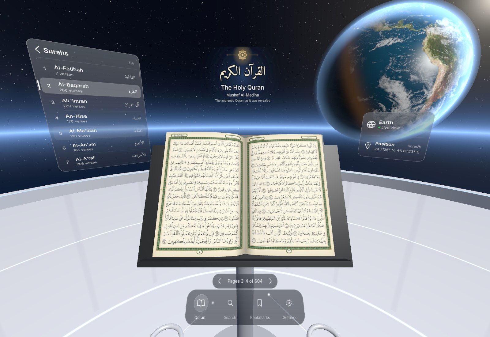
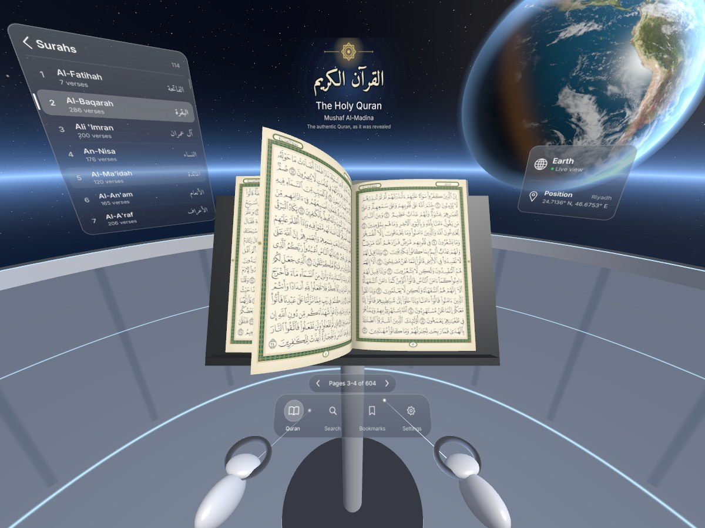
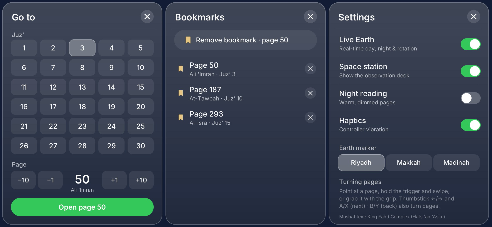

# Quran VR — Mushaf Al-Madina in space

A Meta Quest (OpenXR) app where you read the authentic Madinah Mushaf on a lectern aboard a
space observation deck, with a live Earth floating beside you.



## Install the APK (Meta Quest 2 / Pro / 3 / 3S)

1. Enable **Developer Mode** for your headset in the Meta Horizon phone app.
2. Connect the headset over USB and run:
   ```
   adb install -r dist/QuranVR.apk
   ```
   (or drag `dist/QuranVR.apk` into SideQuest / Meta Quest Developer Hub).
3. On the headset open **Library → Unknown Sources → Quran VR**.

## What's inside

- **The real Mushaf** — all 604 pages of the Madinah Mushaf (Hafs ʿan ʿĀṣim), rendered from the
  King Fahd Complex QCF4 glyphs (1441 AH edition): 15 justified lines per page, surah
  banners, juzʼ headers and page numbers in an ornate green-and-gold frame.
- **Turn pages with your hands** — point at a page, hold the **trigger** and swipe, or reach out
  and **grab** the page with the **grip** button. The page curls over with haptic feedback.
  Pages turn right-to-left like a printed Mushaf: lift the left page to go forward.
  Also: thumbstick ←/→, **A/X** = next, **B/Y** = previous, or the ‹ › pager.
- **Live Earth** — day/night terminator, city lights, clouds and ocean glint follow the real
  sun position right now; the globe turns in real time. A marker shows Riyadh, Makkah or Madinah.
- **visionOS-style glass UI** — Surah list (114 surahs, tap to jump), title, Earth panel, pager,
  and a dock with **Quran · Search · Bookmarks · Settings**:
  - Search: jump to any juzʼ or page.
  - Bookmarks: saved between sessions.
  - Settings: live Earth, show/hide station, night reading (warm dimmed pages), haptics.
- Remembers your last page.




## Building

`./build.sh` produces `dist/QuranVR.apk` on Ubuntu with only `clang`, `lld`, a JDK and the
Debian Android tools (`aapt`, `dalvik-exchange`, `zipalign`, `apksigner`,
`android-sdk-platform-23`) plus Python (`pillow`, `fonttools`, `brotli`). No Android Studio,
Gradle or NDK is needed: the C code is compiled freestanding and linked against generated stub
libraries (`tools/gen_stubs.py`); the device's real system libraries are used at runtime.

| Path | What |
|---|---|
| `native/scene.c` | GLES 3 renderer: baked star cubemap, Earth, deck, lectern, page-curl, panels |
| `native/app.c` | Pointing, trigger-drag / grip-grab page turning, buttons |
| `native/xr_main.c` | OpenXR session, swapchains (4× MSAA), controller actions, JNI bridge |
| `android/java/.../ui/` | Panel layout + drawing (shared with the desktop preview) |
| `tools/render_pages.py` | Renders the 604 Mushaf pages from the QCF4 glyph data |
| `preview/` | Headless desktop preview of the scene (Mesa EGL) used for screenshots |

The APK is signed with a self-generated debug key (`keystore/`, not committed) — fine for
sideloading. For the Meta Horizon Store you would sign with your own release key.

## Credits & licences

- Mushaf text: King Fahd Glorious Quran Printing Complex, QCF4 fonts (Uthman Taha calligraphy),
  via the `quran-qcf4` package. The font licence permits Quranic rendering use only; obtain the
  Complex's permission before any commercial distribution.
- Earth textures: `globe-threejs` / `earth-visualization` (MIT; NASA-derived imagery).
- Fonts: Inter (SIL OFL — the open font closest to Apple's SF Pro, which Apple does not license
  for use outside its platforms) and Amiri (SIL OFL).
- OpenXR loader: Khronos Group (Apache-2.0).
