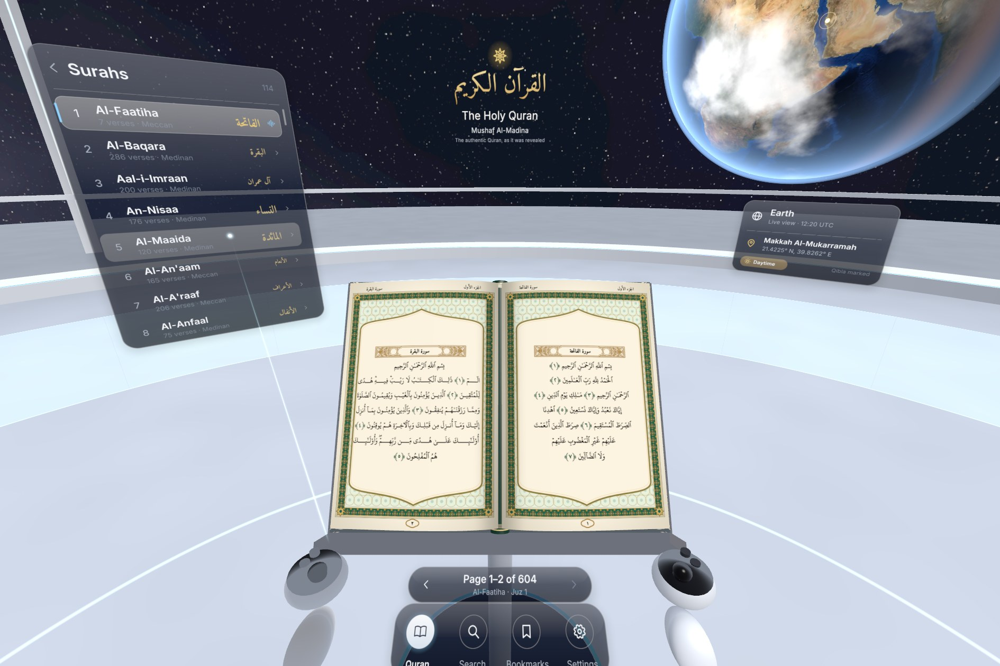
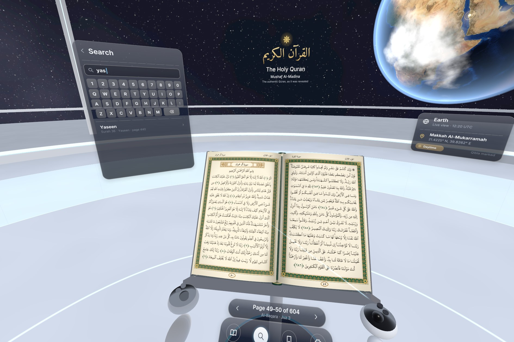
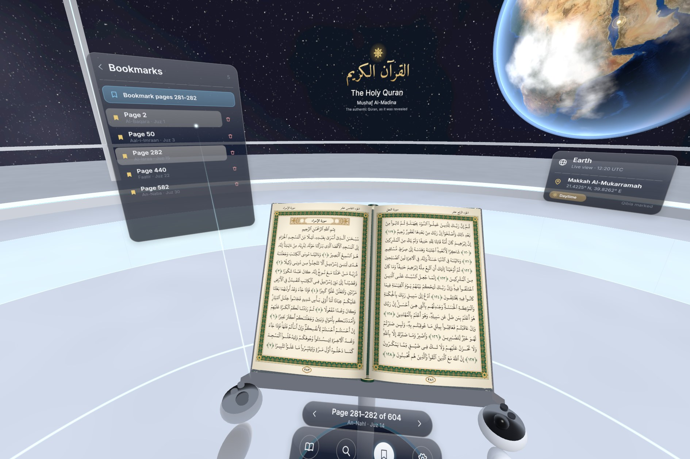
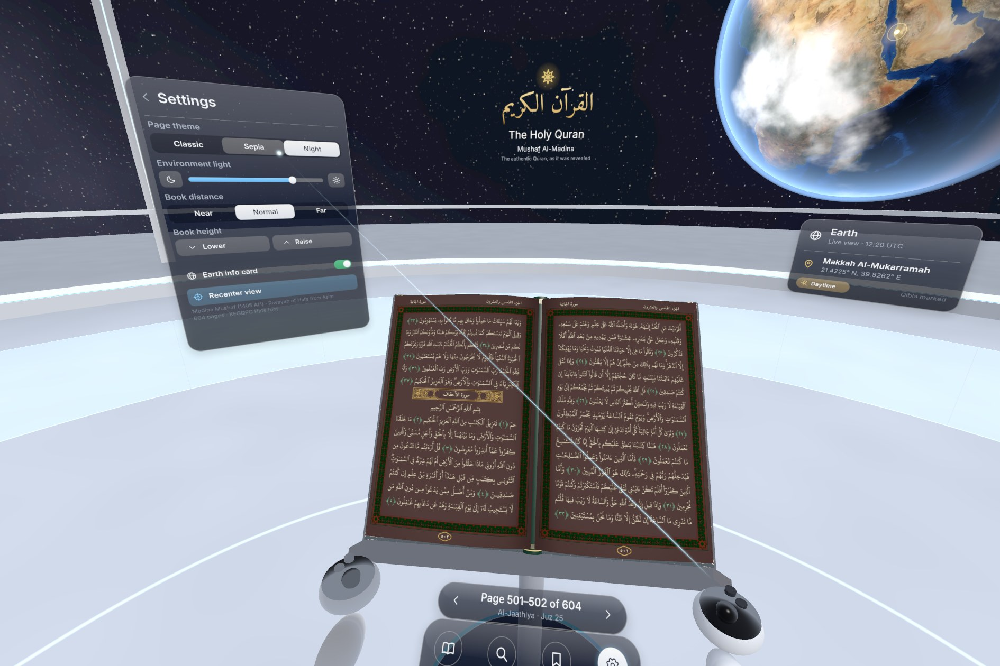
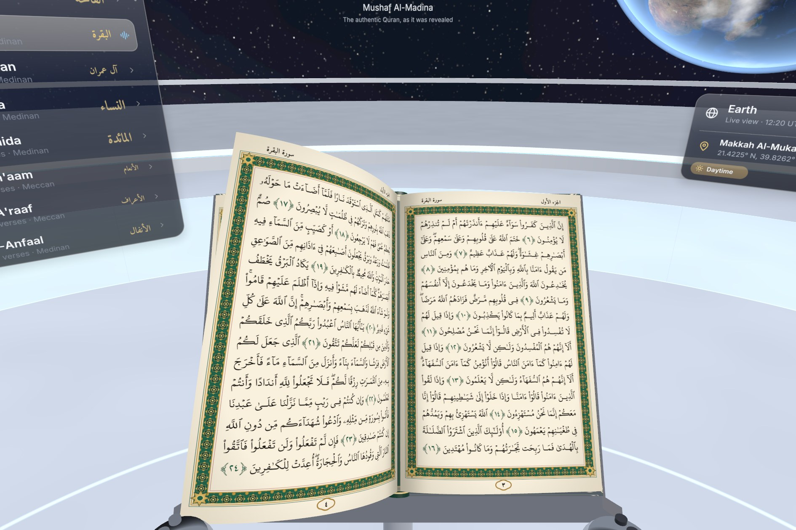
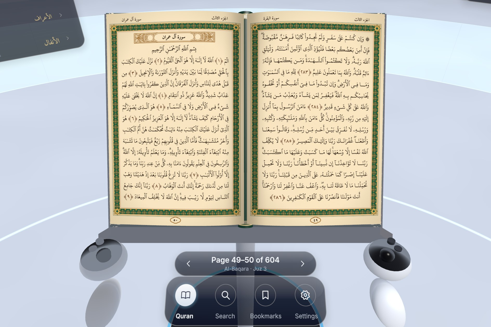

# Holy Quran VR — Mushaf Al-Madina for Meta Quest

A native VR Quran reader for Meta Quest 2 / Pro / 3 / 3S. You sit in a space
observation deck above a live Earth, with the complete 604-page Madina Mushaf
open on a lectern in front of you.



| Search | Bookmarks | Settings + night pages |
|---|---|---|
|  |  |  |

| Page turn | Close reading (sepia) |
|---|---|
|  |  |

*(Screenshots are rendered by the app's own renderer via the desktop preview build.)*

## Features

- **The full Madina Mushaf.** All 604 pages keep the printed edition's exact
  15-line layout, set in the KFGQPC Hafs Uthmani font. Surah title cartouches,
  ornamental ayah markers and the illuminated opening pages are included.
  Right-to-left spreads have a physical page-turn animation.
- **Surah index.** All 114 surahs with transliterated and Arabic names, verse
  counts and Meccan/Medinan labels. The list follows your reading position.
- **Search.** A VR keyboard finds surahs by name or number, pages (`255`) and
  ayah references (`2:255`). A Juz grid jumps to any of the 30 parts.
- **Bookmarks.** Save and return to pages. Bookmarks and your reading position
  are kept between sessions.
- **Settings.** Classic, sepia and night page themes. Environment brightness,
  book distance and height, the Earth card and recentering.
- **Live Earth.** The globe faces Makkah, and its day/night terminator follows
  the real UTC time. Makkah is marked with a pulsing golden light.
- **Comfort.** Everything sits at seated reading distance and stays anchored to
  your recentered position. Panels face you, and controllers give haptic ticks.

### Controls (Touch controllers)

| Action | Input |
|---|---|
| Point / select | Aim with either controller, pull the **trigger** |
| Next page (forward, right-to-left) | Thumbstick **left**, **A/X**, or trigger on the **left page** |
| Previous page | Thumbstick **right**, **B/Y**, or trigger on the **right page** |
| Scroll lists | Thumbstick up/down while pointing at the list, or trigger-drag |
| Hide / show panels (focus mode) | **Menu** button (left controller) |
| Recenter | Hold the Meta button (system), or Settings → Recenter view |

## Install on your headset (sideload)

1. Enable Developer Mode for your Quest in the Meta Horizon phone app.
2. Connect the headset over USB and allow USB debugging.
3. Install the APK:
   `adb install -r HolyQuranVR.apk`
   (or drag it into Meta Quest Developer Hub / SideQuest).
4. On the headset, open it from **Library → Unknown Sources**.

## Publishing on the Meta Horizon Store

1. Create an app in the [Meta Horizon Developer Dashboard](https://developers.meta.com/horizon/manage/).
2. Keep the release keystore (`signing/`, created on first build) safe. Every
   future update must be signed with the same key.
3. Upload `build/HolyQuranVR.apk` to a release channel (Alpha first). The
   manifest already declares the VR intent category, supported devices, head
   tracking, `installLocation="auto"` and OpenXR permissions. The APK is
   64-bit only and v2-signed.
4. Provide store assets (you can base the icon on `docs/icon_512.png`), a
   privacy policy (the app collects no data and uses no network), and run the
   VRC checks in the dashboard.
5. Before release, raise `versionCode` in `android/AndroidManifest.xml` for
   every new upload. Check the dashboard for the minimum `targetSdkVersion`
   Meta currently requires; the manifest targets API 32.

## Building from source

The build needs neither the Android SDK nor the NDK, nor Java code. The app is
a pure `NativeActivity` written in C (OpenXR + OpenGL ES 3). Clang/LLD
cross-compile it for `aarch64-linux-android29` against AOSP bionic headers.
`tools/gen_stubs.py` generates link stubs and checks every libc/libm import
against bionic's symbol maps.

```sh
./setup_toolchain.sh     # clang/lld, aapt2, apksigner, bionic headers, OpenXR loader
./make_assets.sh         # renders the 604 Mushaf pages, UI atlas, frames, Earth textures
./build_apk.sh           # -> build/HolyQuranVR.apk (signed)
./build_desktop.sh && ./build/qvr_preview assets shots   # desktop preview screenshots
```

### Layout

| Path | Contents |
|---|---|
| `src/main_android.c` | NativeActivity + OpenXR session, swapchains (4x MSAA), actions, haptics |
| `src/main_desktop.c` | Headless EGL preview renderer (same app code) used for screenshots |
| `src/app.c` | Reader logic, page turning, UI layout (surahs, search, bookmarks, settings) |
| `src/scene.c`, `src/shaders.h` | Observation deck, lectern + book, Earth/atmosphere, starfield, controllers |
| `src/ui.c` | Immediate-mode 3D UI: SDF glass panels, text/icon atlas, ray interaction |
| `src/pages.c` | Asynchronous page texture streaming (worker decode + LRU GPU cache) |
| `src/quran.c` | Surah/page/juz metadata, search, persistence |
| `tools/` | Asset generators (Chromium/Playwright, Python), stub generator |
| `android/` | Manifest and resources |

Each page texture packs ink, gold ornament and ayah markers into separate
channels. The shader colors them per theme, so one 1000×1540 texture gives
sharp text in classic, sepia and night modes.

## Credits and licenses

- **Mushaf text and line layout:** [quran-madina-html](https://github.com/tarekeldeeb/quran-madina-html)
  by Tarek Eldeeb (Madina Mushaf 1405 AH layout, Waqf General Public License 2.0).
- **Quran font:** KFGQPC Uthmanic Script HAFS, King Fahd Glorious Quran
  Printing Complex (bundled with quran-madina-html).
- **Metadata:** [quran-meta](https://github.com/quran-center/quran-meta) (MIT).
- **UI fonts:** Inter, Amiri, Amiri Quran (SIL Open Font License 1.1).
- **Earth imagery:** NASA Blue Marble / Black Marble (public domain), via the
  [three-globe](https://github.com/vasturiano/three-globe) examples. Clouds are procedural.
- **Libraries:** Khronos OpenXR loader (Apache-2.0), stb_image (public domain / MIT).

Please review the Waqf license and the KFGQPC font terms before a commercial
(paid) release.
